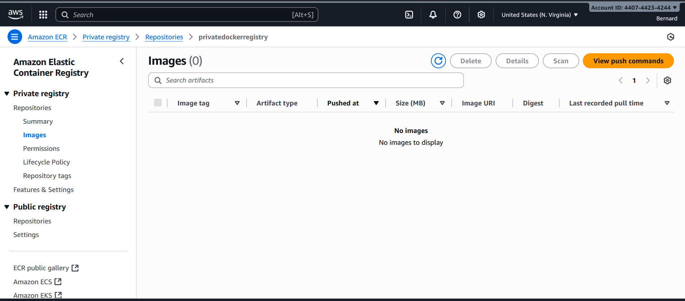

# 🏠 Steps to Create a Private Amazon ECR Repository

Amazon **ECR Private Registry** lets you store container images securely inside your AWS account.

---

## 🔹 Step 1: Navigate to ECR
1. Log in to the **AWS Management Console**.  
2. Search for **ECR (Elastic Container Registry)**.  
3. Under **Private registry**, click **Repositories**.  
4. Click **Create private repository**.  

---

## 🔹 Step 2: General Settings
- **Repository name** 📝  
  - Must start with a **letter**.  
  - Allowed characters: lowercase letters, numbers, `.`, `_`, `-`, `/`.  
  - Example:  
    ```
    myteam/myapp
    ```  
  - Full path looks like:  
    ```
    <aws_account_id>.dkr.ecr.us-east-1.amazonaws.com/myapp
    ```

---

## 🔹 Step 3: Image Tag Settings
- **Tag Mutability** ⚙️  
  - **Mutable** → Tags *can* be overwritten (e.g., `latest`).  
  - **Immutable** → Tags *cannot* be overwritten (safer for production).  
- **Mutable Tag Exclusions (optional)**  
  - Define rules where some tags (e.g., `stable*`) cannot be overwritten.  
  - Supports `*` wildcards.  

---

## 🔹 Step 4: Encryption Settings
- By default, images are encrypted with **AES-256** (industry standard).  
- Optionally, use **AWS KMS (Key Management Service)** if you want to manage your own encryption keys 🔐.  
- ⚠️ Encryption settings **cannot be changed** after repository creation.  

---

## 🔹 Step 5: Review & Create
1. Review all repository settings.  
2. Click **Create repository** ✅.  
3. Your new private repo will appear in the list:  
   ```
   <aws_account_id>.dkr.ecr.<region>.amazonaws.com/<repo-name>
   ```

---

## 🚀 Step 6: Push an Image to Private Repo
1. After creating the repository, **click on the newly created repo**.  
2. Click **View push commands** 📋 (this will show AWS CLI + Docker commands).  

1. Authenticate Docker to ECR:  
   ```bash
   aws ecr get-login-password --region us-east-1 |    docker login --username AWS --password-stdin <aws_account_id>.dkr.ecr.us-east-1.amazonaws.com
   ```

2. Tag your image:  
   ```bash
   docker tag myapp:latest <aws_account_id>.dkr.ecr.us-east-1.amazonaws.com/myapp:latest
   ```

3. Push your image:  
   ```bash
   docker push <aws_account_id>.dkr.ecr.us-east-1.amazonaws.com/myapp:latest
   ```

4. Pull later (from anywhere with access):  
   ```bash
   docker pull <aws_account_id>.dkr.ecr.us-east-1.amazonaws.com/myapp:latest
   ```

---

✅ Now you have a **secure private ECR repository** with encryption and tag management options! 🎉  
